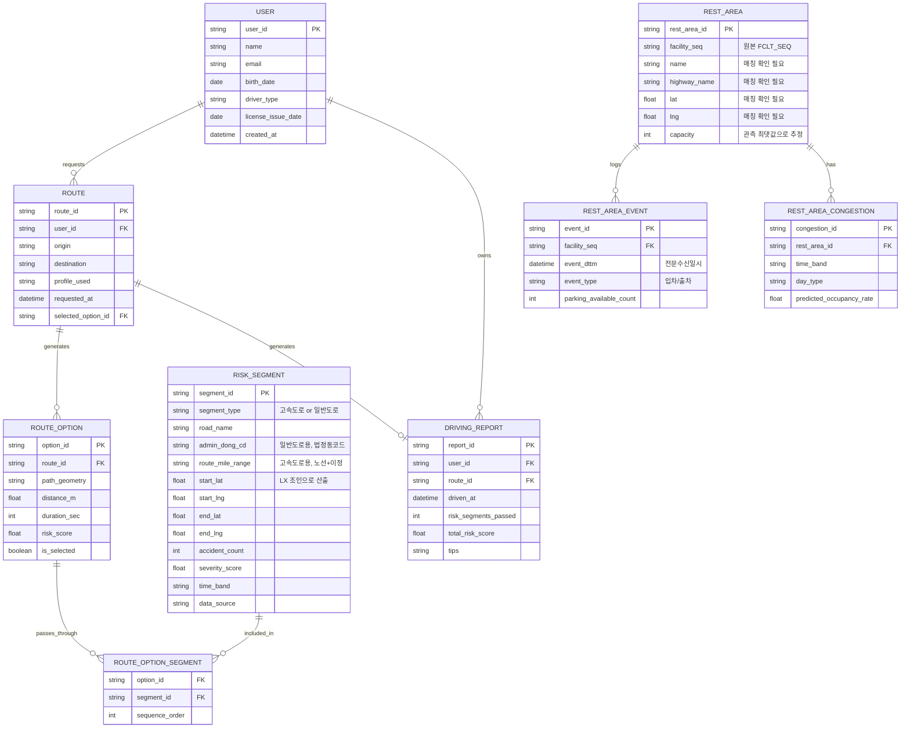

# 뉴비로

> 2026 데이터안심구역 서비스 경진대회 개인 참가 프로젝트
> 이 문서는 claude.ai에서 진행한 기획 대화 전체를 정리한 것입니다. Claude Code(또는 다른 AI 어시스턴트)는 이 문서를 프로젝트의 전체 컨텍스트로 사용하면 됩니다. 문서 맨 아래 "AI 어시스턴트를 위한 다음 작업" 섹션에 바로 시작할 작업이 정리되어 있습니다.

---

## 1. 프로젝트 개요

**서비스명**: 뉴비로 — 초보운전자를 뜻하는 '뉴비(newbie)'와 길을 뜻하는 '로(路)'를 합친 이름

**한 줄 정의**: 사고이력·유동인구 데이터로 산출한 구간별 위험도를 반영해 경로를 추천하고, 졸음쉼터 혼잡도까지 안내하는 예방적 안전운전 서비스

**문제 정의**: 초보운전자와 고령운전자는 도로 상황 판단 경험이 상대적으로 부족해 특정 시간대·구간에서 사고 위험에 더 크게 노출된다. 그러나 현재 대중적으로 쓰이는 내비게이션 서비스는 최단시간·최단거리 위주로 경로를 안내할 뿐, 과거 사고 이력에 기반한 위험도는 반영하지 않는다. 장거리 운전 중 졸음운전 사고 예방을 위해 졸음쉼터가 운영되지만, 혼잡도 정보가 없어 쉼터를 찾았다가 만차로 되돌아 나오는 비효율이 발생한다.

**핵심 타깃**: 면허취득 1년 이내 초보운전자, 고령운전자, 장거리·야간 운전자

**차별성**:

- 2025년 수상작 "구해줘헬기즈"는 사고 발생 이후의 이송 최적화(사후 대응)에 초점 — 본 서비스는 사고 발생 자체를 줄이는 사전 예방에 초점
- 일반 내비게이션의 최단·최속 경로 vs 위험도까지 반영한 다중 경로 후보 제시
- 사고 데이터 단독이 아닌 유동인구 데이터로 통행량 대비 위험도(노출도 보정)를 계산해 단순 사고건수 비교의 왜곡을 줄임
- 졸음쉼터 데이터를 별도 기능이 아닌 경로 추천 흐름에 통합

**기대효과**:

- 공익적: 초보·고령운전자 사고 예방, 교통안전 인식 제고
- 산업적: 내비게이션·보험업계와의 협업 가능성(위험도 기반 보험료 산정 등)
- 데이터 융합: 이종 데이터(사고+유동인구+센서) 결합을 통한 노출도 보정 위험도 산출 방법론

---

## 2. 대회 정보

- **대회명**: 2026 데이터안심구역 서비스 경진대회
- **참가 형태**: 개인 참가
- **참가신청·기획서 제출**: 2026.09.01(화) ~ 10.22(목) 18시
- **예선(서면·기술평가)**: 2026.10.28(수) ~ 10.29(목) — 1.5배수(31개 팀) 선정
- **본선(발표평가)**: 2026.11.18(수) ~ 11.19(목)
- **시상식**: 2026.12 중, 「데이터·클라우드 진흥주간」 개최 기간
- **시상 규모**: 대상 1점(부총리 겸 과학기술정보통신부장관상, 300만원), 최우수상 9점(기관별 각 200만원), 우수상 5점(각 100만원), 특별상 5점(각 30만원 상당)
- **특별 혜택**: 우수상 이상 수상 시 나이스지니데이타 2027년도 신입사원 채용 서류전형 합격 제공
- **수상 전략**: 시상 훈격이 기관명으로 걸려있어, 여러 기관 데이터를 골고루 섞기보다 **한 기관(또는 두 기관)을 메인으로 확실히 밀고 1~2개 보조 데이터로 완성도를 높이는 전략**이 유리하다고 판단함. 뉴비로는 **한국도로교통공단장상 + 한국도로공사장상**을 동시에 정조준하는 컨셉.

### 검토했던 다른 아이디어 (참고용, 채택 안 함)

- 나이스지니데이타 데이터로 소상공인 창업 입지 추천 서비스 (경쟁 강도가 가장 높은 카테고리라 우선순위를 낮춤)
- SKT+신한카드+프랜차이즈 데이터로 연령대/시간대별 코스 추천 서비스
- 편의점/슈퍼마켓/외식 POS + 생활폐기물 데이터로 상품 재고 추천 서비스 (데이터 간 연결고리가 약해 기각)

---

## 3. 플랫폼 결정: 웹(PWA), 네이티브 앱·일렉트론 아님

- **네이티브 모바일 앱**: 대회 일정상(앱스토어 심사 기간) 비현실적이라 기각
- **일렉트론(데스크톱 앱)**: 핵심 기능인 "주행 모드"가 GPS·차량 거치 시나리오를 전제로 하는데 데스크톱 환경 자체가 이 유즈케이스와 안 맞아서 기각
- **채택**: 모바일 웹으로 먼저 완성 → 시간 남으면 PWA(manifest + service worker)로 확장. 개발자가 과거 교내 서비스(OSJ)에서 파이어베이스 기반 백그라운드 알림 + PWA 구현 경험이 있어 리스크가 낮음. 다만 "뉴비로"의 주행 모드는 화면을 켜놓고 보는 포그라운드 시나리오가 기본이라, 백그라운드 푸시보다 구현이 쉬운 포그라운드 실시간 경고로 스코프를 잡음.
- 반응형이되 **세로 모드(portrait) 우선, 모바일 화면(360~430px 너비) 기준**으로 디자인

---

## 4. 활용 데이터

### 4.1 대회 데이터 안심구역 개요

데이터산업법 제11조 근거. 미개방데이터(공개하기엔 민감하지만 활용가치 높은 데이터)를 원본 그대로 반출시키지 않고 통제된 보안 환경 안에서만 분석하게 해주는 제도. 안심구역 종류에 따라 온라인(가상화) 이용이 가능한 곳도 있으나(예: 농림축산식품 데이터안심구역), **뉴비로에 필요한 데이터(한국도로교통공단/SKT는 한국데이터산업진흥원 안심구역, 졸음쉼터는 한국도로공사 "국토교통 데이터안심구역")는 방문 필수형**임. 원본 데이터는 반출 불가, 집계·가공된 통계만 반출 심사 통과 후 반출 가능.

**"대회용 상호 제공 미개방데이터는 데이터안심구역(9개 기관, 11개 센터)에서 모두 활용 가능"** — 즉 필요한 3종 데이터(도로교통공단/도로공사/SKT)가 서로 다른 기관 소속이어도 대회 기간 중에는 **아무 센터나 한 곳만 방문하면 다 이용 가능**. 세종 거주 기준 최적 방문지: 한국데이터산업진흥원 **대전센터**(충남대 대덕캠퍼스 AI정보화본부교육관).

### 4.2 핵심 활용 데이터

| 구분                    | 데이터명 (기관)                                   | 기간            | 활용 방식                                                              |
| ----------------------- | ------------------------------------------------- | --------------- | ---------------------------------------------------------------------- |
| 핵심                    | 교통사고 데이터 (한국도로교통공단)                | 2020.01~2024.12 | 일반도로 구간별 사고 빈도·심각도 위험도 스코어 산출                    |
| 핵심                    | 성/연령별·요일별·시간대별 유동인구 데이터 (SKT)   | 2024.01~2024.12 | 구간별 통행량 대비 사고율(노출도 보정) 산출                            |
| 핵심                    | 졸음쉼터 주차감지 센서 수집 데이터 (한국도로공사) | 2019.04~2021.11 | 시간대별 혼잡 패턴 학습 → 혼잡 예측                                    |
| 보조                    | 고속도로 교통사고 데이터 (한국도로공사)           | 1989.01~2023.07 | 고속도로 구간 사고 이력 보강                                           |
| 보조(필수급으로 격상됨) | 수치지형도 / DEM 5M (한국국토정보공사)            | 2024.11 기준    | 도로망 그래프 구축, 읍면동/노선+이정 위치를 실제 좌표로 매핑(공간조인) |

### 4.3 실제 데이터정의서 확인 후 발견한 중요 이슈 (v1 설계와 다른 부분)

업로드받은 4개 기관 데이터정의서(한국국토정보공사, 한국도로공사, SKT, 한국도로교통공단)를 확인한 결과:

1. **한국도로교통공단 교통사고 데이터**: 위경도 좌표가 없음. 위치가 `sido_nm`(시도)/`sigungu_nm`(시군구)/`bjd_nm`(읍면동) 텍스트로만 기록됨. 즉 정밀도가 "읍면동 단위"까지가 한계.
2. **한국도로공사 고속도로 사고 데이터**: 대신 `사고발생 고속도로노선` + `사고발생이정(km)`이라는 선형좌표(예: "경부선 356.1km 지점")로 비교적 정밀. 단 고속도로 한정.
3. **SKT 유동인구**: `X_COORD`/`Y_COORD`(UTM-K 좌표계) 50m×50m 격자 단위로 정밀함.
4. **한국국토정보공사 수치지형도**: 도로 벡터 geometry + `ROAD_SE`(도로구분코드)를 가지고 있어, 위 텍스트/선형 기반 위치를 실제 지도 좌표로 연결하는 다리 역할을 함. → **이 데이터가 없으면 지도 기반 서비스 구현이 불가능**하므로 "보조·선택"이 아니라 사실상 필수 데이터로 격상됨.
5. **졸음쉼터 데이터(IOT_PRKG)**: 이미 집계된 혼잡도 표가 아니라 **센서 단위 원시 입출차 이벤트 로그**임. 컬럼: `SNSR_ID`(센서ID), `FCLT_SEQ`(시설일련번호), `WHTT_RCPTN_DTTM`(이벤트 수신시각), `SNSR_PSSN_STAT_CD`(출차/주차 이벤트), `PRKG_ABLE_TRCN`(그 순간의 주차가능대수) 등. **휴게소 이름도 좌표도 없고, `FCLT_SEQ`라는 내부 번호만 있음.** 코드파일 제공 여부가 FALSE로 표시되어 있어, 이 번호를 실제 시설명·위치와 매칭하는 별도 조인 테이블이 기본 제공되지 않을 가능성이 있음 → **방문 전 헬프데스크에 확인 필요한 최우선 이슈**.

### 4.4 실제 파일 스펙 (안심구역 방문 시 참고)

- **한국도로교통공단 교통사고 데이터**: UTF-8, 콤마 구분
- **한국도로공사 고속도로 사고 데이터(TB_EX_TRAFACC.csv)**: ANSI(cp949) 인코딩, 콤마 구분, 쌍따옴표 인용. 컬럼 예: `사고발생 고속도로노선`, `사고발생이정`, `사망`, `중상`, `경상`
- **한국도로공사 졸음쉼터 데이터(TB_EX_IOT_PRKG.csv)**: ANSI(cp949), 콤마 구분. 컬럼: `SNSR_ID`, `WHTT_RCPTN_DTTM`, `FCLT_SEQ`, `PRKG_SNSR_CLSS_CD`, `SNSR_PSSN_STAT_CD`, `BTCG_RATE`, `SNSR_DSBL_OCRN_CD`, `RADR_STAT_CD`, `PRKG_ABLE_TRCN` 등
- **SKT 유동인구**: UTF-8, **파이프(`|`) 구분자** (다른 파일들과 다름, 주의). 컬럼에 `X_COORD`/`Y_COORD`(UTM-K), 시간대별 `TMST_00`~`TMST_23` 형태의 wide format 컬럼 존재
- **한국국토정보공사 수치지형도**: Shapefile 형태로 추정, `ROAD_SE`(도로구분: 고속국도/일반국도/지방도 등), `ROAD_NM`(도로명) 등 속성 + geometry

---

## 5. ERD (v2 — 실제 데이터정의서 반영)

### 변경 이력

- v1: RISK_SEGMENT를 처음부터 위경도 기반으로 설계 (실제 데이터와 안 맞음이 확인됨)
- v2: 아래 반영 — segment_type/법정동코드/노선+이정 필드 추가, 좌표는 "LX 조인으로 산출되는 값"으로 명시. 졸음쉼터는 원시 이벤트 테이블(REST_AREA_EVENT)을 추가하고 여기서 배치 집계해 REST_AREA_CONGESTION을 만드는 구조로 변경.

### 엔티티 전체 스키마

**USER (사용자)**

- `user_id` PK
- `name`
- `email`
- `birth_date`
- `driver_type` (초보/고령/일반)
- `license_issue_date`
- `created_at`

**ROUTE (경로조회이력)**

- `route_id` PK
- `user_id` FK
- `origin`
- `destination`
- `profile_used`
- `requested_at`
- `selected_option_id` FK

**ROUTE_OPTION (경로 후보)**

- `option_id` PK
- `route_id` FK
- `path_geometry`
- `distance_m`
- `duration_sec`
- `risk_score`
- `is_selected`

**ROUTE_OPTION_SEGMENT (경로 후보 ↔ 위험구간 매핑)**

- `option_id` FK
- `segment_id` FK
- `sequence_order`

**RISK_SEGMENT (사고위험구간) — v2 변경**

- `segment_id` PK
- `segment_type` (고속도로 / 일반도로) — 신규
- `road_name` (표시용 명칭)
- `admin_dong_cd` (일반도로용, 법정동코드) — 신규, nullable
- `route_mile_range` (고속도로용, 노선+이정 구간) — 신규, nullable
- `start_lat`/`start_lng`/`end_lat`/`end_lng` (**LX 수치지형도 조인으로 산출되는 값**, 원천 데이터엔 없음)
- `accident_count`
- `severity_score`
- `time_band`
- `data_source` (한국도로교통공단 / 한국도로공사)

**REST_AREA (졸음쉼터) — v2 변경**

- `rest_area_id` PK
- `facility_seq` (원본 `FCLT_SEQ`) — 신규
- `name` (매칭 확인 필요 — nullable)
- `highway_name` (매칭 확인 필요 — nullable)
- `lat`/`lng` (매칭 확인 필요 — nullable)
- `capacity` (관측된 `PRKG_ABLE_TRCN` 최댓값으로 추정)

**REST_AREA_EVENT (졸음쉼터 원시 이벤트) — v2 신규**

- `event_id` PK
- `facility_seq` FK
- `event_dttm` (전문수신일시)
- `event_type` (입차/출차)
- `parking_available_count`

**REST_AREA_CONGESTION (혼잡도 예측 — REST_AREA_EVENT를 배치 ETL로 집계해서 채움)**

- `congestion_id` PK
- `rest_area_id` FK
- `time_band`
- `day_type`
- `predicted_occupancy_rate`

**DRIVING_REPORT (운행 후 리포트)**

- `report_id` PK
- `user_id` FK
- `route_id` FK
- `driven_at`
- `risk_segments_passed`
- `total_risk_score`
- `tips`

### 관계

- USER 1:N ROUTE (요청)
- ROUTE 1:N ROUTE_OPTION (생성)
- ROUTE_OPTION 1:N ROUTE_OPTION_SEGMENT
- RISK_SEGMENT 1:N ROUTE_OPTION_SEGMENT
- REST_AREA 1:N REST_AREA_EVENT (기록)
- REST_AREA_EVENT → REST_AREA_CONGESTION (배치 집계, ETL — FK 관계 아님)
- REST_AREA 1:N REST_AREA_CONGESTION (보유)
- USER 1:N DRIVING_REPORT (소유)
- ROUTE 1:1 DRIVING_REPORT (생성)

### Mermaid ERD 코드

---

## 6. API 명세 (v2)

**Base URL**: `https://api.newbiero.app` (예시)
**인증**: `Authorization: Bearer {access_token}` 헤더 (회원가입/로그인 제외 전 API)
**응답 포맷**: JSON, 공통 에러 포맷 `{ "error_code": string, "message": string }`

| 기능     | Method | Endpoint                                  | 설명                            | 요청 파라미터                                                      | 응답 필드                                                                                                                        |
| -------- | ------ | ----------------------------------------- | ------------------------------- | ------------------------------------------------------------------ | -------------------------------------------------------------------------------------------------------------------------------- |
| 회원     | POST   | /api/users/signup                         | 회원가입 및 운전자 프로필 등록  | name, email, password, birth_date, driver_type, license_issue_date | user_id, created_at                                                                                                              |
| 회원     | POST   | /api/users/login                          | 로그인                          | email, password                                                    | access_token, user_id                                                                                                            |
| 회원     | GET    | /api/users/me                             | 내 프로필 조회                  | (인증 토큰)                                                        | user_id, name, driver_type, license_issue_date                                                                                   |
| 회원     | PATCH  | /api/users/me                             | 프로필 수정                     | driver_type, name                                                  | user_id, driver_type                                                                                                             |
| 경로     | POST   | /api/routes                               | 위험도 가중 경로 추천 요청      | origin(lat/lng), destination(lat/lng), profile_used                | route_id, options                                              |
| 경로     | GET    | /api/routes/{route_id}                    | 경로 조회 결과 상세             | route_id (path)                                                    | route_id, origin, destination, options[]                                                                                         |
| 경로     | POST   | /api/routes/{route_id}/select             | 경로 후보 선택(주행 시작)       | route_id, option_id                                                | route_id, selected_option_id, started_at                                                                                         |
| 경로     | GET    | /api/routes/history                       | 경로 조회 이력 목록             | user_id(인증), page, size                                          | routes                                                                            |
| 위험구간 | GET    | /api/risk-segments                        | 사고다발구간 목록/히트맵 조회   | bbox, time_band, segment_type                                      | segments |
| 위험구간 | GET    | /api/risk-segments/{segment_id}           | 위험구간 상세 조회              | segment_id (path)                                                  | segment_id, segment_type, road_name, admin_dong_cd, route_mile_range, accident_count, severity_score, data_source                |
| 졸음쉼터 | GET    | /api/rest-areas                           | 경로 상 졸음쉼터 목록 조회      | route_id 또는 bbox                                                 | rest_areas                                                               |
| 졸음쉼터 | GET    | /api/rest-areas/{rest_area_id}/congestion | 시간대별 예상 혼잡도 조회       | rest_area_id, time_band, day_type                                  | rest_area_id, time_band, predicted_occupancy_rate                                                                                |
| 알림     | GET    | /api/alerts                               | 프로필 기반 진입 경고 이력 조회 | user_id(인증), route_id                                            | alerts                                                                         |
| 알림     | POST   | /api/alerts                               | 주행 중 위험구간 진입 경고 기록 (v2.1 추가) | route_id, segment_id(선택), alert_type                             | alert_id, segment_id, alert_type, triggered_at                                                                                   |
| 리포트   | POST   | /api/driving-reports                      | 주행 종료 후 리포트 생성        | route_id, driven_at, gps_track                                     | report_id, risk_segments_passed, total_risk_score, tips                                                                          |
| 리포트   | GET    | /api/driving-reports/{report_id}          | 운행 리포트 상세 조회           | report_id (path)                                                   | report_id, driven_at, risk_segments_passed, total_risk_score, tips                                                               |
| 리포트   | GET    | /api/driving-reports/summary              | 마이페이지 누적 통계 조회       | user_id(인증), period                                              | total_trips, total_risk_segments_passed, avg_risk_score, trend[]                                                                 |

### 핵심 플로우별 호출 순서

1. **경로 검색**: `POST /api/routes` → `options[]` 중 하나를 `POST /api/routes/{route_id}/select`
2. **경로 상세 확인**: `GET /api/routes/{route_id}` + `GET /api/risk-segments?bbox=...`
3. **졸음쉼터 확인**: `GET /api/rest-areas?route_id=...` → `GET /api/rest-areas/{rest_area_id}/congestion`
4. **주행 중 위험구간 진입**: 위험구간 300m 이내 진입 시 경고 배너 표시와 함께 `POST /api/alerts`로 진입 이력 기록
5. **주행 종료 후**: `POST /api/driving-reports` → `GET /api/driving-reports/{report_id}`
6. **마이페이지**: `GET /api/driving-reports/summary` + `GET /api/routes/history`

---

## 7. 화면 설계 (10개 화면)

전체 흐름: 스플래시 → (신규유저) 온보딩/회원가입 → 로그인 → 메인 → 경로 결과 → (선택) 경로 상세 → 주행 모드 → 운행 후 리포트 → 마이페이지. 메인과 마이페이지는 하단 탭으로 상호 이동.

### 화면별 상세

**1. 스플래시** — 로그인 상태 확인 후 자동 라우팅. 요소: 로고, 로딩 인디케이터.

**2. 온보딩·회원가입** — 신규 유저의 운전자 프로필(초보/고령/일반)을 최초 수집. 이름/이메일/비밀번호, 생년월일, 면허취득일 입력 → 운전자 타입 자동 산출(면허취득 1년 이내면 초보운전자로 자동 분류, 수동 수정 가능).

**3. 로그인** — 이메일/비밀번호 입력.

**4. 메인 (핵심)** — 출발지 입력(기본값 현재 위치), 목적지 입력(자동완성), 운전자 프로필 세그먼트 토글(초보/일반/고령), "안전 경로 찾기" CTA, 최근 검색지 리스트, 하단 탭바(홈/마이페이지).

- 허용 데이터 필드: origin, destination, driver_type, 최근 검색지 리스트(origin/destination/requested_at)

**5. 경로 결과 (핵심)** — 상단 지도(사고다발구간 히트맵 오버레이 토글), 하단 경로 후보 카드 정확히 2개(추천 안전경로/최단경로) — 각 distance_m/duration_sec/risk_score(낮음·보통·높음 배지로만 표현) 표시, 정렬 토글(안전순/최단순).

- 허용 데이터 필드: distance_m, duration_sec, risk_score, is_selected. **3개 이상의 경로 카드를 만들지 않음.**

**6. 경로 상세** — 구간별 위험도 막대그래프(road_name, severity_score), 지도 위 위험구간 마커(탭 시 road_name·accident_count 툴팁), 졸음쉼터 마커+혼잡도 배지(여유/보통/혼잡 3단계).

- 허용 데이터 필드: road_name, accident_count, severity_score, rest_area name, predicted_occupancy_rate

**7. 주행 모드 (가장 중요, 시인성 최우선)** — 내비게이션 지도(풀블리드), 위험구간 진입 300m 전 경고 배너(운전자 프로필별 문구 차등), 졸음쉼터 접근 시 혼잡도 팝업 + 대체 쉼터 안내.

- 허용 데이터 필드: road_name, severity_score, alert_type, predicted_occupancy_rate. **속도계·연료 등 차량 정보는 없음(데이터 없음).**

**8. 운행 후 리포트** — 이번 주행 위험구간 통과 횟수(risk_segments_passed), 종합 위험도(total_risk_score, 3단계 배지), 미니맵(지나온 위험구간 점 표시, 텍스트 라벨 없음), 개선 팁 카드(tips, 1개).

- 허용 데이터 필드: risk_segments_passed, total_risk_score, tips, driven_at. **개별 위험구간 이름은 이 화면에 노출하지 않음(리포트 화면 필드 목록에 없음). 게이미피케이션 요소(포인트, 레벨) 없음.**

**9. 마이페이지** — 프로필 요약(name, driver_type), 통계 카드 3개(total_trips, total_risk_segments_passed, avg_risk_score), 최근 8주 위험도 추이 그래프(trend[]), 경로 조회 이력 리스트(origin/destination/requested_at), 하단 탭바.

**10. 프로필 수정** — 이름, 운전자 타입(수동 재설정), 면허취득일 수정.

### 데이터 표시 원칙 (매우 중요 — 디자인/개발 모두 준수)

- 각 화면에 표시되는 텍스트·숫자는 위 "허용 데이터 필드" 목록에 있는 것만 사용
- 평점, 리뷰, 가격, 광고/프로모션, 실제로 없는 임의 통계("이용자 10만명"), 소셜 공유/팔로우, 게이미피케이션(포인트/레벨/뱃지 수집) — **전부 이 서비스에 존재하지 않는 데이터이므로 절대 추가하지 않음**
- risk_score/severity_score/predicted_occupancy_rate는 원칙적으로 "낮음/보통/높음" 또는 "여유/보통/혼잡" 3단계 배지로만 표현하고, 임의의 정밀 수치(%, 점수)를 새로 지어내지 않음

---

## 8. 디자인 시스템

### 컬러

| 용도                          | 컬러                                                | 비고                                              |
| ----------------------------- | --------------------------------------------------- | ------------------------------------------------- |
| 메인 브랜드 컬러 (라이트모드) | 네이비/딥블루 `#1F3864` ~ `#1B3A66` 계열            | 헤더, 주요 버튼, 강조 텍스트                      |
| 메인 브랜드 컬러 (다크모드)   | 밝은 스카이블루 `#4C8DFF` ~ `#5B9BFF` 계열          | 어두운 배경 위 시인성 확보                        |
| 위험도/혼잡도 신호색          | 초록(안전/여유) · 노랑(주의/보통) · 빨강(위험/혼잡) | 브랜드 컬러와 절대 혼용 금지. 오직 상태 표시 전용 |
| 금지 컬러                     | 민트/청록 계열                                      | 다른 프로젝트(JobLog)와의 아이덴티티 혼선 방지    |

### 타이포그래피

- 폰트: **Pretendard** (Pretendard Variable 우선)
- 본문 최소 16px, 위험도 배지·경고 문구는 20px 이상 굵은 웨이트 (운전 중 가독성 고려)

### 톤앤매너

- 신뢰감 있고 차분한 "안전" 이미지, 과도한 장식/그라데이션 지양
- 운전 중 힐끗 봐도 0.5초 안에 "안전한지 아닌지" 파악되는 수준의 대비/크기
- 아이콘은 단순명료(경고 삼각형, 방향 화살표, 쉼터 아이콘 등)
- 라이트/다크 모드 둘 다 처음부터 지원 (야간 운전 사용 비중이 높음을 고려)
- 경로 후보 카드는 획일적인 회색 카드 대신, 왼쪽에 위험도 색상 바(border-left)를 넣어 배지를 안 봐도 구분 가능하게 함

### 이미 만들어진 목업

`뉴비로_화면목업.html` 파일에 6개 핵심 화면(메인/경로결과/경로상세/주행모드/리포트/마이페이지)이 라이트/다크 모드 토글 가능한 형태로 이미 구현되어 있음. 순수 HTML/CSS/inline SVG로 작성, Pretendard는 jsdelivr CDN에서 로드. 이 목업의 마크업·스타일 구조를 그대로 실제 프론트엔드 컴포넌트로 옮겨도 됨.

---

## 9. 안심구역 방문 계획

### 프로세스 (일반)

1. 안심구역 포털(dsz.kdata.or.kr) 가입 및 데이터 선택
2. 이용 신청서 작성 (분석계획서, 보안서약서, 반입자료 등록, 분석환경 선택)
3. 심의 대기 (최대 10일 소요 — 기획서 마감(10/22)을 고려하면 최대한 빨리 신청 필요)
4. 방문 및 분석 (신분증 지참, 지정 PC만 사용, 인터넷 차단, 반입되지 않은 외부 자료 사용/촬영 금지)
5. 결과물 반출 신청 (원본 데이터 미포함, 집계 통계만 반출 심사 통과 후 다운로드)

### 신청서 작성 시 체크한 항목

- **이용신청 구분**: 한국도로교통공단(교통사고), SKT(유동인구), 한국도로공사(졸음쉼터+고속도로사고), 한국국토정보공사(수치지형도/DEM) — 전부 체크. 대회 데이터는 상호제공이라 한 센터 방문으로 전부 이용 가능.
- **개인/팀 구분**: 개인
- **분석환경**: Jupyterlab(Python/pandas, 위험도 스코어링) + QGIS(수치지형도 공간조인)
- **분석지원요청**: 예. 분석 수준은 **Level 3**(일반적인 사용법은 알지만 에러·낯선 도메인 문제는 스스로 해결하기 어려운 수준)으로 판단.
    - 지원 요청 내용: ① 수치지형도(shp) 도로 벡터와 사고 집계 결과(법정동코드/노선+이정 기준)를 좌표로 매칭하는 QGIS 공간조인 지원, ② 졸음쉼터 FCLT_SEQ ↔ 실제 시설명·위치 매칭 코드표 존재 여부 확인

### 반입자료 (이미 작성 완료, 실제 컬럼명 기준으로 사전 테스트 통과)

- `risk_scoring.py` — 일반도로(읍면동 단위)+고속도로(노선+이정 단위) 사고 데이터를 위험도 점수로 집계하는 스크립트. `INPUT_PATHS`만 실제 파일 경로로 바꿔서 실행하면 됨. `python risk_scoring.py --test`로 더미 데이터 자체 테스트 가능.
- `congestion_aggregation.py` — 졸음쉼터 원시 입출차 이벤트 로그를 시간대(2시간 단위)·요일유형(평일/주말) 기준으로 재구성해 예상 혼잡도(predicted_occupancy_rate)를 산출하는 스크립트. `PRKG_ABLE_TRCN`(주차가능대수)으로 점유율을 역산하고, 총 주차면수를 모르면 관측된 최댓값을 임시 총면수로 사용. `--test` 플래그로 자체 테스트 가능.

### 참고자료 (신청서 첨부용, 이미 작성 완료)

- `뉴비로_분석계획서.docx` — 분석 목적/활용 데이터/5단계 방법론/반출 예정 산출물을 정리한 정식 계획서
- `risk_segment_template.csv` — 반출 예정 파일의 헤더만 있는 양식 (segment_id, segment_type, road_name, admin_dong_cd, route_mile_range, time_band, accident_count, severity_score, data_source)
- `rest_area_congestion_template.csv` — 반출 예정 파일 양식 (congestion_id, facility_seq, time_band, day_type, predicted_occupancy_rate)

### 방문 당일(1일) 스케줄 초안

- 09:00~09:30 입실, 환경 확인, 반입 스크립트 정상 동작 확인
- 09:30~11:00 위험도 스코어링 2건(일반도로/고속도로) 실행 — 실제 데이터 이슈 대응 버퍼 포함
- 11:00~11:30 사전 준비한 법정동 중심좌표·고속도로 이정-좌표 lookup 테이블과 조인 (LX 정밀 데이터가 필요하면 QGIS 지원 요청)
- 11:30~12:30 점심
- 12:30~13:30 졸음쉼터 FCLT_SEQ 매칭 확인 + 혼잡도 스크립트 실행
- 13:30~14:30 결과 검증 및 반출 신청서 작성
- 14:30~ 심사 대기 (당일 처리 여부 미확인 — 헬프데스크에 사전 확인 필요)
- **시간이 부족하면 졸음쉼터 혼잡도(부가 기능)는 과감히 포기하고 위험도 스코어링(핵심 기능)만 확실히 반출할 것**

### 아직 확인되지 않은 리스크 (방문 전/중 반드시 확인)

1. 졸음쉼터 `FCLT_SEQ`를 실제 시설명·위치와 매칭할 별도 코드표가 있는지
2. 반출 심사가 방문 당일 처리되는지, 아니면 별도 기간이 걸리는지
3. 반출 승인된 파일을 실제로 어떻게 전달받는지 (포털 다운로드 vs 이메일 등, 기관마다 다름)
4. 대회 포털(dsz.kdata.or.kr)의 실제 신청서 양식이 이 문서의 가정과 다른 부분이 있는지

---

## 10. 기술 스택 (제안)

- **프론트엔드**: React 기반 웹앱 + 지도 API(카카오맵/네이버맵 등, 라이선스 확인 필요), Tailwind 또는 순수 CSS(위 디자인 시스템의 CSS 변수 구조 재사용 가능)
- **데이터 분석/ETL**: Python(pandas) — `risk_scoring.py`, `congestion_aggregation.py` 참고
- **경로 탐색**: 오픈소스 라우팅 엔진(OSRM 등)에 반출된 위험도 스코어 테이블을 커스텀 가중치로 주입해 다중 경로 산출
- **배포**: Vercel 등으로 빠르게 배포해 데모 링크 확보. 시간이 남으면 PWA manifest 추가

---

## 11. 지금까지 만들어진 파일 목록

| 파일명                                                                | 용도                                                                                                          |
| --------------------------------------------------------------------- | ------------------------------------------------------------------------------------------------------------- |
| 뉴비로\_기획서.docx                                                   | 대회 제출용 아이디어 기획서 (Word)                                                                            |
| 뉴비로*기획서.md / 뉴비로*활용데이터.csv / 뉴비로\_기능명세.csv       | 기획서 노션용 버전 (표는 CSV로 분리, 노션 DB로 import)                                                        |
| 뉴비로*화면설계서.md / 뉴비로*화면설계서.csv / 뉴비로\_화면흐름도.png | 화면 설계서 (10개 화면) 및 흐름도                                                                             |
| 뉴비로\_ERD.md / 뉴비로\_ERD.png                                      | ERD (v2, 이 문서의 5번 섹션과 동일 내용)                                                                      |
| 뉴비로\_API명세서.md / 뉴비로\_API명세서.csv                          | API 명세서 (v2, 이 문서의 6번 섹션과 동일 내용)                                                               |
| 뉴비로*디자인AI*프롬프트.md                                           | 외부 디자인 AI(v0, Galileo 등)에 붙여넣을 디자인 브리프. 화면별 허용 데이터 필드, 컬러 시스템, 폰트 규칙 포함 |
| 뉴비로\_화면목업.html                                                 | 실제로 만든 6개 화면 목업 (라이트/다크 토글 가능한 단일 HTML 파일)                                            |
| 뉴비로\_분석계획서.docx                                               | 안심구역 이용신청서 참고자료용 분석계획서                                                                     |
| risk_scoring.py / congestion_aggregation.py                           | 안심구역 반입용 분석 스크립트 (실제 컬럼명 기준, 더미 데이터로 테스트 완료)                                   |
| risk_segment_template.csv / rest_area_congestion_template.csv         | 반출 예정 집계표 양식                                                                                         |

---

## 12. AI 어시스턴트를 위한 다음 작업

이 프로젝트를 이어받아 개발을 진행한다면 다음 순서를 권장합니다.

1. **`뉴비로_화면목업.html`을 열어서 디자인 시스템(컬러 변수, 컴포넌트 구조)을 확인**하고, 이를 기준으로 React 컴포넌트로 이식할 것. 목업의 CSS 변수(`--brand`, `--safe`, `--caution`, `--danger` 등)를 그대로 디자인 토큰으로 사용하면 됨.
2. 아직 실제 데이터는 없는 상태(안심구역 방문 전)이므로, **`risk_segment_template.csv`, `rest_area_congestion_template.csv`의 컬럼 구조를 따르는 mock 데이터**를 만들어서 프론트엔드/API를 먼저 구현할 것. 실제 안심구역에서 반출한 데이터가 나오면 이 mock을 교체하면 됨.
3. **화면 10개(7번 섹션)를 위 화면설계서 그대로 라우팅 구조로 구현**. 특히 "주행 모드" 화면이 이 서비스의 핵심이므로 가장 먼저, 가장 신경 써서 구현할 것.
4. **API는 6번 섹션의 명세를 기준으로 mock 서버(json-server 등) 또는 실제 백엔드로 구현**. 아직 라우팅 엔진(OSRM) 연동 전이면, `/api/routes` 응답은 하드코딩된 2개 경로 후보로 우선 구현해도 됨.
5. 데이터 표시 원칙(7번 섹션 마지막)을 반드시 지킬 것 — 존재하지 않는 데이터(평점, 가격, 게이미피케이션 등)를 임의로 추가하지 말 것.
6. PWA 전환은 핵심 기능이 다 완성된 뒤 마지막에 진행 (manifest.json + service worker 추가).
